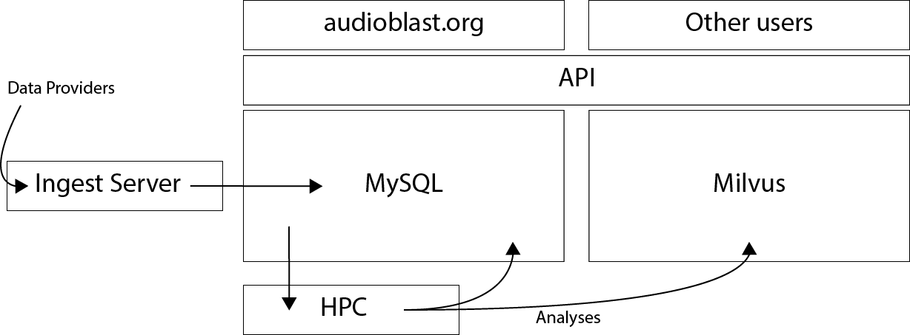

# Introduction

## Design Philosophy

The technical design of audioBlast pushes computation down the stack as far as is conveniently possible. Ideally this will often be the database. This results in a reduction in network traffic, which can be significant if returning a large number of analyses.

Some core parts of the audioBlast system (i.e. the ingest process and analyse process) can communicate directly with the database, and all insertion or updating of records must be performed through one of these processes.

In general, and for all end-user cases, reading of data should be performed via the API (<https://api.audioblast.org>). The API is a lightweight database wrapper that automatically handles pagination of results and caching of slow queries. Various utilities provide access to the API in different environments, including the sonicscrewdriver package for the R environment. The API is also used to provide the data search and discovery tools at <https://audioblast.org>.

```{r, echo=FALSE}

  layers <- rbind(
    database <- c("Triggers<br><br>INSERT<br><br>UPDATE", "Stored Procedures<br><br>INSERT<br><br>UPDATE", "SELECT"),
    r <- c("r-dbi<br><br>abdb", "r-dbi<br><br>abdb", ""),
    api <- c("", "", "API QueryBuilder"),
    users <- c("", "", "API Calls")
  )
rownames(layers) <- c("MySQL", "R", "API", "Users")
colnames(layers) <- c("Ingest", "Analyse", "API")

knitr::kable(
  layers, booktabs = TRUE,
  caption = 'Simplified illustration of audioBlast abstraction layers from 
  bottom to top.'
)
```

## Analyse everything once, in advance

Many bioacoustic and ecoacoustic studies make use of a standard set of analyses. These are computed in advance by audioBlast, allowing the analyses to be instantly available and searchable. An additional advantage is that the computational resource needed to compute analyses need only be performed once.

## Infrastructure


